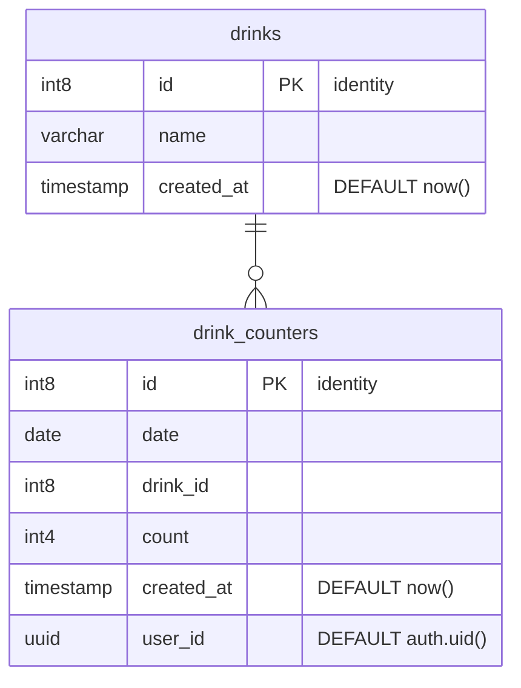

| No.  | タイプ | 物理名         | 論理名                   |
| :--- | :----- | :------------- | :----------------------- |
| 1    | table  | drinks         | 飲み物                   |
| 2    | table  | drink_counters | 飲酒杯数カウントテーブル |

