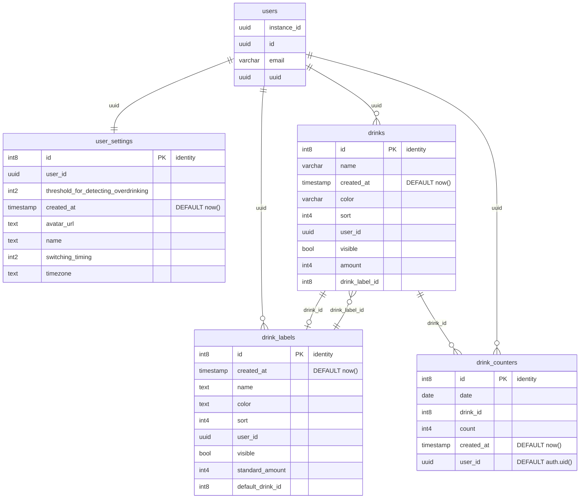

| No.  | スキーマ | 物理名         | 論理名                   |
| :--- | :------- | :------------- | :----------------------- |
| 1    | auth     | users          | ユーザー                 |
| 1    | public   | user_settings  | ユーザー設定             |
| 3    | public   | drink_labels   | 飲み物ラベルマスター     |
| 2    | public   | drinks         | 飲み物マスター           |
| 4    | public   | drink_counters | 飲酒杯数カウントテーブル |

```mermaid
erDiagram
  users ||--|| user_settings : "uuid"
  users ||--o{ drinks : "uuid"
  users ||--o{ drink_labels : "uuid"
  drinks ||--o| drink_labels : "drink_id"
  drinks ||--o{ drink_counters : "drink_id"
  users ||--o{ drink_counters : "uuid"
  drink_labels ||--o{ drinks : "drink_label_id"
  users {
    uuid instance_id
    uuid id
    varchar email
    uuid uuid
  }
  user_settings {
    int8 id PK "identity"
    uuid user_id
    int2 threshold_for_detecting_overdrinking
    timestamp created_at "DEFAULT now()"
    text avatar_url
    text name
    int2 switching_timing
    text timezone
  }
  drink_labels {
    int8 id PK "identity"
    timestamp created_at "DEFAULT now()"
    text name
    text color
    int4 sort
    uuid user_id
    bool visible
    int4 standard_amount
    int8 default_drink_id
  }
  drinks {
    int8 id PK "identity"
    varchar name
    timestamp created_at "DEFAULT now()"
    varchar color
    int4 sort
    uuid user_id
    bool visible
    int4 amount
    int8 drink_label_id
  }
  drink_counters {
    int8 id PK "identity"
    date date
    int8 drink_id
    int4 count
    timestamp created_at "DEFAULT now()"
    uuid user_id "DEFAULT auth.uid()"
  }
```
